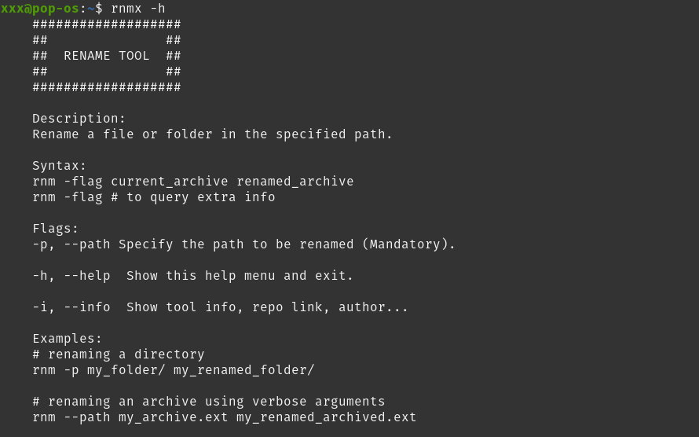

# Rename tool ( rnm )

A rename CLI tool to make easy the process mainly in linux systems written in Rust.


## Examples

```bash
# renaming a directory
rnm -p my_folder/ my_renamed_folder/

# renaming an archive using verbose arguments
rnm --path my_archive.ext my_renamed_archived.ext
```


## Screenshots




## Usage

### Syntax

```bash
rnm -flag current_archive renamed_archive

rnm -flag # to query extra info
```

### Flags

```bash
-p, --path Specify the path to be renamed (Mandatory)

-h, --help Show this help menu and exit.

-i, --info Show tool info, repo link, author...
```

## License

This tool and code can be distributed, edited or used under the [MIT](./LICENSE) license conditions.


## Authors

- [@amtr4x](https://www.github.com/Amtr4x)


## Contributing

Contributions are always welcome, 
just explain your **PR** and let's merge!


## FAQ

#### Is secure to use this tool?

Yes, completely secure. It is not a tool that need extra permissions or violate your OS permissions extructure. No telemetry or Adwares, just a cleaned tool.

#### Which OS ( Operative System ) is needed to use this tool?

Currently you can use this tool in:
- Windows 10 or superior.
- Linux systems.
- MacOS

-- You can test the tool in a different OS, just main support is intended to these systems.

#### Can I make a thank you donation?

Yes, currently you can send me some:

TRX:
```plaintext
TSrWQBjjnUfDmfA59VirUvhmiYjiFbWwAN
```

BTC:
```plaintext
bc1qfd50nm4dzjx3asl0eaw0sw64c67kfyz5akara6
```

All amounts are well received. Thanks for use my tool and improve it with your **PR**s

